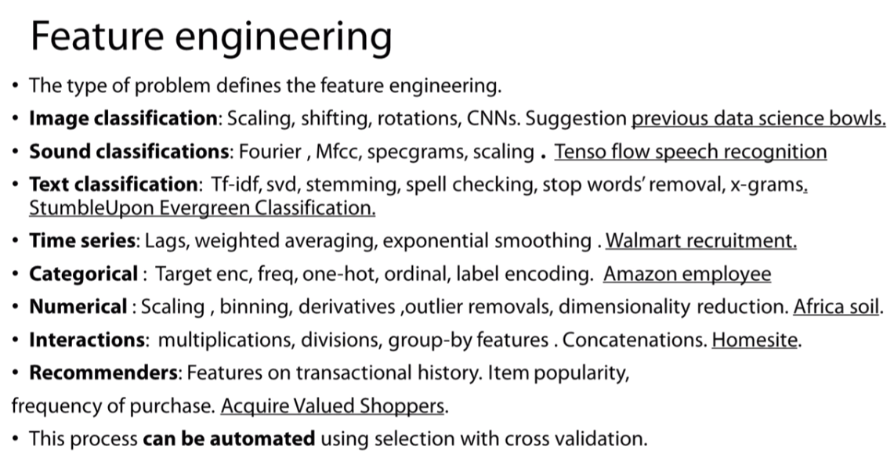
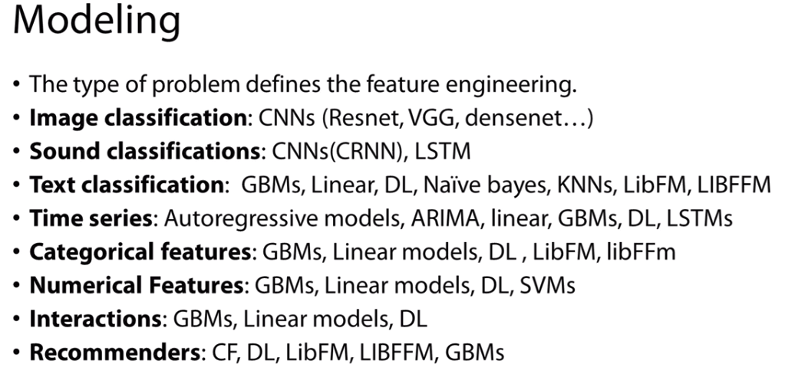

# DataMiningNotesAndPractice
记录我关于在数据挖掘中，一些从入门到实战所积累的技巧。 
代码很多都是直接从项目中复制出来的，比较乱，见谅。
## 目录
- [配置科学计算环境](https://github.com/wmpscc/DataMiningNotesAndPractice/blob/master/1.%E7%8E%AF%E5%A2%83%E5%AE%89%E8%A3%85.md)
- [KMeans算法与交通事故理赔审核预测](https://github.com/wmpscc/DataMiningNotesAndPractice/blob/master/2.KMeans%E7%AE%97%E6%B3%95%E4%B8%8E%E4%BA%A4%E9%80%9A%E4%BA%8B%E6%95%85%E7%90%86%E8%B5%94%E5%AE%A1%E6%A0%B8%E9%A2%84%E6%B5%8B.md)
- [Matplotlib学习笔记](https://github.com/wmpscc/DataMiningNotesAndPractice/blob/master/3.Matplotlib%E5%AD%A6%E4%B9%A0%E7%AC%94%E8%AE%B0.md)
- [NumPy学习笔记](https://github.com/wmpscc/DataMiningNotesAndPractice/blob/master/4.NumPy%E5%AD%A6%E4%B9%A0%E7%AC%94%E8%AE%B0.md)
- [Pandas学习笔记](https://github.com/wmpscc/DataMiningNotesAndPractice/blob/master/5.Pandas%E5%AD%A6%E4%B9%A0%E7%AC%94%E8%AE%B0.md)
- [数据预处理笔记](https://github.com/wmpscc/DataMiningNotesAndPractice/blob/master/6.%E6%95%B0%E6%8D%AE%E9%A2%84%E5%A4%84%E7%90%86%E7%AC%94%E8%AE%B0.md)
- [机器学习部分](https://github.com/wmpscc/DataMiningNotesAndPractice/blob/master/7.%E6%9C%BA%E5%99%A8%E5%AD%A6%E4%B9%A0%E9%83%A8%E5%88%86.md)
- [SKlearn模型评估方法](https://github.com/wmpscc/DataMiningNotesAndPractice/blob/master/8.SKlearn%E6%A8%A1%E5%9E%8B%E8%AF%84%E4%BC%B0%E6%96%B9%E6%B3%95.md)
- [Kaggle杂记](https://github.com/wmpscc/DataMiningNotesAndPractice/blob/master/9.Kaggle%E6%9D%82%E8%AE%B0.md)
## 实战篇
- 1.[数据探索](https://github.com/wmpscc/DataMiningNotesAndPractice/blob/master/%E5%AE%9E%E6%88%98%E7%AF%87/1.%E6%95%B0%E6%8D%AE%E6%8E%A2%E7%B4%A2/README.md)
- 2.[数据预处理](https://github.com/wmpscc/DataMiningNotesAndPractice/blob/master/%E5%AE%9E%E6%88%98%E7%AF%87/2.%E6%95%B0%E6%8D%AE%E9%A2%84%E5%A4%84%E7%90%86/README.md)
- 3.[电力窃漏电用户自动识别](https://github.com/wmpscc/DataMiningNotesAndPractice/tree/master/%E5%AE%9E%E6%88%98%E7%AF%87/3.%E7%94%B5%E5%8A%9B%E7%AA%83%E6%BC%8F%E7%94%B5%E7%94%A8%E6%88%B7%E8%87%AA%E5%8A%A8%E8%AF%86%E5%88%AB/README.md)
- 4.[地震后建筑修复建议预测](https://github.com/wmpscc/DataMiningNotesAndPractice/blob/master/%E5%AE%9E%E6%88%98%E7%AF%87/4.%E5%9C%B0%E9%9C%87%E5%90%8E%E5%BB%BA%E7%AD%91%E4%BF%AE%E5%A4%8D%E5%BB%BA%E8%AE%AE%E9%A2%84%E6%B5%8B/README.md)
- 5.[Kaggle Titanic](https://github.com/wmpscc/DataMiningNotesAndPractice/blob/master/%E5%AE%9E%E6%88%98%E7%AF%87/5.Titanic/Kaggle%20Titanic%20Best%20Score.ipynb)

## 高级特征工程
该部分为Coursera上的[How to Win a Data Science Competition: Learn from Top Kagglers](https://www.coursera.org/learn/competitive-data-science/home/welcome)课程笔记。下载后，请使用jupyter notebook打开。
- [Tips and tricks](https://github.com/wmpscc/DataMiningNotesAndPractice/blob/master/%E9%AB%98%E7%BA%A7%E7%89%B9%E5%BE%81%E5%B7%A5%E7%A8%8B/Tips%20and%20tricks.ipynb)
- [Advanced Feature Engineering I](https://github.com/wmpscc/DataMiningNotesAndPractice/blob/master/%E9%AB%98%E7%BA%A7%E7%89%B9%E5%BE%81%E5%B7%A5%E7%A8%8B/Advanced%20Feature%20Engineering%20I.ipynb)
- [Hyperparameter tuning](https://github.com/wmpscc/DataMiningNotesAndPractice/blob/master/%E9%AB%98%E7%BA%A7%E7%89%B9%E5%BE%81%E5%B7%A5%E7%A8%8B/Hyperparameter%20tuning.ipynb)
- [Advanced Feature Engineering II](https://github.com/wmpscc/DataMiningNotesAndPractice/blob/master/%E9%AB%98%E7%BA%A7%E7%89%B9%E5%BE%81%E5%B7%A5%E7%A8%8B/Advanced%20Feature%20Engineering%20II.ipynb)
- feature engineering

- modeling

