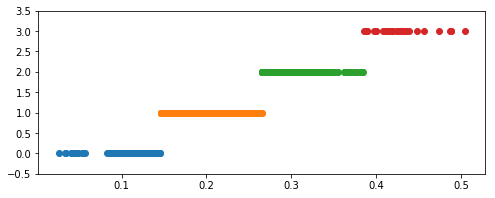
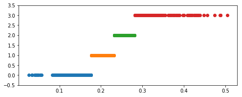
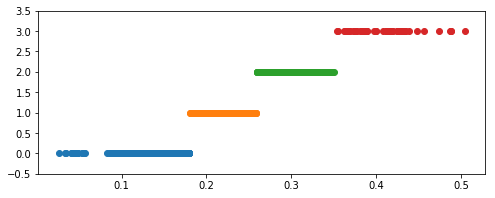

## 常用函数
**Python 主要数据预处理函数**

|函数名|函数功能|所属库|
|:-:|:-:|:-:|
|interpolate|一维、高维数据插值|Scipy|
|unique|去除数据中的重复元素，得到单值元素列表，它是对象的方法名|Pandas/Numpy|
|isnull|判断是否空值|Pandas|
|notnull|判断是否非空值|Pandas|
|PCA|对指标变量矩阵进行主成分分析|Scikit-Learn|
|random|生成随机矩阵|Numpy|

# 基本流程
- **1.检查数据**
- **2.缺失值处理**
- **3.异常值处理**
- **4.数据集成**
- **5.数据变换**
- **6.数据规约**
- **7.变量表示**

## 检查数据
读入数据中的第一步，就是检查数据，看看都有哪些变量，这些变量分布如何，是不是存在错误的观测。

#### 服装消费者数据描述：
- age:年龄
- gender:性别
- income:收入
- house:是否有房子
- store_exp:实体店消费额
- online_exp:在线消费额
- store_trans:在实体店交易次数
- online_trans:在线交易次数
- Q1~Q10:问卷的10个问题（非常不同意：1；有点不同意：2；中立/不知道：3；有点同意：4；非常同意：5）
- segment:消费者分组(价格敏感：Price；炫耀性消费：Conspicuous；质量：Quality；风格：Style)


```python
import pandas as pd
import numpy as np
import os
import matplotlib.pyplot as plt
%matplotlib inline

data = pd.read_csv("data/segdata.csv")
data.head()
```


<div>
<style scoped>
    .dataframe tbody tr th:only-of-type {
        vertical-align: middle;
    }

    .dataframe tbody tr th {
        vertical-align: top;
    }

    .dataframe thead th {
        text-align: right;
    }
</style>
<table border="1" class="dataframe">
  <thead>
    <tr style="text-align: right;">
      <th></th>
      <th>age</th>
      <th>gender</th>
      <th>income</th>
      <th>house</th>
      <th>store_exp</th>
      <th>online_exp</th>
      <th>store_trans</th>
      <th>online_trans</th>
      <th>Q1</th>
      <th>Q2</th>
      <th>Q3</th>
      <th>Q4</th>
      <th>Q5</th>
      <th>Q6</th>
      <th>Q7</th>
      <th>Q8</th>
      <th>Q9</th>
      <th>Q10</th>
      <th>segment</th>
    </tr>
  </thead>
  <tbody>
    <tr>
      <th>0</th>
      <td>57</td>
      <td>Female</td>
      <td>120963.400958</td>
      <td>Yes</td>
      <td>529.134363</td>
      <td>303.512475</td>
      <td>2</td>
      <td>2</td>
      <td>4</td>
      <td>2</td>
      <td>1</td>
      <td>2</td>
      <td>1</td>
      <td>4</td>
      <td>1</td>
      <td>4</td>
      <td>2</td>
      <td>4</td>
      <td>Price</td>
    </tr>
    <tr>
      <th>1</th>
      <td>63</td>
      <td>Female</td>
      <td>122008.104950</td>
      <td>Yes</td>
      <td>478.005781</td>
      <td>109.529710</td>
      <td>4</td>
      <td>2</td>
      <td>4</td>
      <td>1</td>
      <td>1</td>
      <td>2</td>
      <td>1</td>
      <td>4</td>
      <td>1</td>
      <td>4</td>
      <td>1</td>
      <td>4</td>
      <td>Price</td>
    </tr>
    <tr>
      <th>2</th>
      <td>59</td>
      <td>Male</td>
      <td>114202.295294</td>
      <td>Yes</td>
      <td>490.810731</td>
      <td>279.249582</td>
      <td>7</td>
      <td>2</td>
      <td>5</td>
      <td>2</td>
      <td>1</td>
      <td>2</td>
      <td>1</td>
      <td>4</td>
      <td>1</td>
      <td>4</td>
      <td>1</td>
      <td>4</td>
      <td>Price</td>
    </tr>
    <tr>
      <th>3</th>
      <td>60</td>
      <td>Male</td>
      <td>113616.337078</td>
      <td>Yes</td>
      <td>347.809004</td>
      <td>141.669752</td>
      <td>10</td>
      <td>2</td>
      <td>5</td>
      <td>2</td>
      <td>1</td>
      <td>3</td>
      <td>1</td>
      <td>4</td>
      <td>1</td>
      <td>4</td>
      <td>2</td>
      <td>4</td>
      <td>Price</td>
    </tr>
    <tr>
      <th>4</th>
      <td>51</td>
      <td>Male</td>
      <td>124252.552787</td>
      <td>Yes</td>
      <td>379.625940</td>
      <td>112.237177</td>
      <td>4</td>
      <td>4</td>
      <td>4</td>
      <td>1</td>
      <td>1</td>
      <td>3</td>
      <td>1</td>
      <td>4</td>
      <td>1</td>
      <td>4</td>
      <td>2</td>
      <td>4</td>
      <td>Price</td>
    </tr>
  </tbody>
</table>
</div>


```python
data.info()
```

    <class 'pandas.core.frame.DataFrame'>
    RangeIndex: 1000 entries, 0 to 999
    Data columns (total 19 columns):
    age             1000 non-null int64
    gender          1000 non-null object
    income          816 non-null float64
    house           1000 non-null object
    store_exp       1000 non-null float64
    online_exp      1000 non-null float64
    store_trans     1000 non-null int64
    online_trans    1000 non-null int64
    Q1              1000 non-null int64
    Q2              1000 non-null int64
    Q3              1000 non-null int64
    Q4              1000 non-null int64
    Q5              1000 non-null int64
    Q6              1000 non-null int64
    Q7              1000 non-null int64
    Q8              1000 non-null int64
    Q9              1000 non-null int64
    Q10             1000 non-null int64
    segment         1000 non-null object
    dtypes: float64(3), int64(13), object(3)
    memory usage: 148.5+ KB


```python
data.describe()
```


<div>
<style scoped>
    .dataframe tbody tr th:only-of-type {
        vertical-align: middle;
    }

    .dataframe tbody tr th {
        vertical-align: top;
    }

    .dataframe thead th {
        text-align: right;
    }
</style>
<table border="1" class="dataframe">
  <thead>
    <tr style="text-align: right;">
      <th></th>
      <th>age</th>
      <th>income</th>
      <th>store_exp</th>
      <th>online_exp</th>
      <th>store_trans</th>
      <th>online_trans</th>
      <th>Q1</th>
      <th>Q2</th>
      <th>Q3</th>
      <th>Q4</th>
      <th>Q5</th>
      <th>Q6</th>
      <th>Q7</th>
      <th>Q8</th>
      <th>Q9</th>
      <th>Q10</th>
    </tr>
  </thead>
  <tbody>
    <tr>
      <th>count</th>
      <td>1000.000000</td>
      <td>816.000000</td>
      <td>1000.000000</td>
      <td>1000.000000</td>
      <td>1000.000000</td>
      <td>1000.000000</td>
      <td>1000.000000</td>
      <td>1000.000000</td>
      <td>1000.000000</td>
      <td>1000.000000</td>
      <td>1000.000000</td>
      <td>1000.000000</td>
      <td>1000.000000</td>
      <td>1000.000000</td>
      <td>1000.000000</td>
      <td>1000.000000</td>
    </tr>
    <tr>
      <th>mean</th>
      <td>38.840000</td>
      <td>113543.065222</td>
      <td>1356.850523</td>
      <td>2120.181187</td>
      <td>5.350000</td>
      <td>13.546000</td>
      <td>3.101000</td>
      <td>1.823000</td>
      <td>1.992000</td>
      <td>2.763000</td>
      <td>2.945000</td>
      <td>2.448000</td>
      <td>3.434000</td>
      <td>2.396000</td>
      <td>3.085000</td>
      <td>2.320000</td>
    </tr>
    <tr>
      <th>std</th>
      <td>16.416818</td>
      <td>49842.287197</td>
      <td>2774.399785</td>
      <td>1731.224308</td>
      <td>3.695559</td>
      <td>7.956959</td>
      <td>1.450139</td>
      <td>1.168348</td>
      <td>1.402106</td>
      <td>1.155061</td>
      <td>1.284377</td>
      <td>1.438529</td>
      <td>1.455941</td>
      <td>1.154347</td>
      <td>1.118493</td>
      <td>1.136174</td>
    </tr>
    <tr>
      <th>min</th>
      <td>16.000000</td>
      <td>41775.637023</td>
      <td>-500.000000</td>
      <td>68.817228</td>
      <td>1.000000</td>
      <td>1.000000</td>
      <td>1.000000</td>
      <td>1.000000</td>
      <td>1.000000</td>
      <td>1.000000</td>
      <td>1.000000</td>
      <td>1.000000</td>
      <td>1.000000</td>
      <td>1.000000</td>
      <td>1.000000</td>
      <td>1.000000</td>
    </tr>
    <tr>
      <th>25%</th>
      <td>25.000000</td>
      <td>85832.393634</td>
      <td>204.976456</td>
      <td>420.341127</td>
      <td>3.000000</td>
      <td>6.000000</td>
      <td>2.000000</td>
      <td>1.000000</td>
      <td>1.000000</td>
      <td>2.000000</td>
      <td>1.750000</td>
      <td>1.000000</td>
      <td>2.500000</td>
      <td>1.000000</td>
      <td>2.000000</td>
      <td>1.000000</td>
    </tr>
    <tr>
      <th>50%</th>
      <td>36.000000</td>
      <td>93868.682835</td>
      <td>328.980863</td>
      <td>1941.855436</td>
      <td>4.000000</td>
      <td>14.000000</td>
      <td>3.000000</td>
      <td>1.000000</td>
      <td>1.000000</td>
      <td>3.000000</td>
      <td>4.000000</td>
      <td>2.000000</td>
      <td>4.000000</td>
      <td>2.000000</td>
      <td>4.000000</td>
      <td>2.000000</td>
    </tr>
    <tr>
      <th>75%</th>
      <td>53.000000</td>
      <td>124572.400926</td>
      <td>597.293077</td>
      <td>2440.774823</td>
      <td>7.000000</td>
      <td>20.000000</td>
      <td>4.000000</td>
      <td>2.000000</td>
      <td>3.000000</td>
      <td>4.000000</td>
      <td>4.000000</td>
      <td>4.000000</td>
      <td>4.000000</td>
      <td>3.000000</td>
      <td>4.000000</td>
      <td>3.000000</td>
    </tr>
    <tr>
      <th>max</th>
      <td>300.000000</td>
      <td>319704.337941</td>
      <td>50000.000000</td>
      <td>9479.442310</td>
      <td>20.000000</td>
      <td>36.000000</td>
      <td>5.000000</td>
      <td>5.000000</td>
      <td>5.000000</td>
      <td>5.000000</td>
      <td>5.000000</td>
      <td>5.000000</td>
      <td>5.000000</td>
      <td>5.000000</td>
      <td>5.000000</td>
      <td>5.000000</td>
    </tr>
  </tbody>
</table>
</div>


由上面的数据发现有什么问题吗？
- `age`：的最大值是300，这不大可能。
- `income`：存在缺失值（816/1000）
- `store_exp`：不应该存在负数、还可能存在离群值，最大消费为50000
- online_exp：看上去没什么问题
- store_trans和online_trans：看上去还比较合理
- Q1~Q10：值的范围都在1~5之内，貌似没问题

那怎么处理这些错误的值呢？这取决于你的实际情况，如果你的样本量很大，不在乎这几个样本，那么就可以删除这些不合理的值。在这里，由于我们只有1000个样本，并且获取这些数据不易，所以得想办法填补这些异常值。我们先把这些值设为缺失状态。


```python
# 将错误的年龄观测设置为缺失值
data['age'].loc[data['age'] > 100] = np.nan
# 将错误的实体店购买设置为缺失值
data['store_exp'].loc[data['store_exp'] < 0] = np.nan
# 查看处理后数据的情况
data.info()
```

    <class 'pandas.core.frame.DataFrame'>
    RangeIndex: 1000 entries, 0 to 999
    Data columns (total 19 columns):
    age             999 non-null float64
    gender          1000 non-null object
    income          816 non-null float64
    house           1000 non-null object
    store_exp       999 non-null float64
    online_exp      1000 non-null float64
    store_trans     1000 non-null int64
    online_trans    1000 non-null int64
    Q1              1000 non-null int64
    Q2              1000 non-null int64
    Q3              1000 non-null int64
    Q4              1000 non-null int64
    Q5              1000 non-null int64
    Q6              1000 non-null int64
    Q7              1000 non-null int64
    Q8              1000 non-null int64
    Q9              1000 non-null int64
    Q10             1000 non-null int64
    segment         1000 non-null object
    dtypes: float64(4), int64(12), object(3)
    memory usage: 148.5+ KB


    /home/heolis/anaconda3/envs/tensorflow/lib/python3.5/site-packages/pandas/core/indexing.py:194: SettingWithCopyWarning: 
    A value is trying to be set on a copy of a slice from a DataFrame
    
    See the caveats in the documentation: http://pandas.pydata.org/pandas-docs/stable/indexing.html#indexing-view-versus-copy
      self._setitem_with_indexer(indexer, value)


## 缺失值处理
处理缺失值方法可分为3类：删除记录、数据插补和不处理。

缺失值处理要视情况而定，没有某个方法永远比其他方法好。<br>
在决定处理缺失值值的方法之前，要先了解缺失的原因等关于缺失的辅助信息。
- 缺失是随机发生的吗？如果是，可以用中位数/众数进行填充，也可以使用均值填充。
- 或者说缺失其实是有潜在发生机制的吗？比如年龄大的人在问卷调查中更不愿意透露年龄，这样关于年龄的缺失就不是随机发生的，如果使用均值或者中位数进行填补可能会产生很大偏差。这时需要利用年龄和其他自变量的关系对缺失值进行估计。比如可以基于那些没有缺失值的数据来建模，然后拟合模型预测缺失值。


如果建模的目的是预测，大部分情况下不会很严格地研究缺失机制（缺失机制很明显的时候除外），在缺失机制不太清楚的情况下，可以当成随机缺失进行填补（使用均值中位数或者用K-近邻）


**常用的插补方法**

|插补方法|方法描述|
|:-:|:-:|
|均值/中位数/众数插补|根据属性的类型，用该属性取值的平均数/中位数/众数进行插补|
|使用固定值|将缺失的属性值用一个常量替换。如广州一个工厂普通外来务工人员的“基本工资”属性的缺失值，可以用当年广州市普通外来务工人员工资标准1895元/月填补。|
|最近临填补|在记录中找到与缺失样本最近的样本的该属性值插补|
|回归方法|对带有缺失值的变量，根据已有数据和其有关的其他变量（因变量）的数据建立拟合模型来预测缺失的属性值|
|插值法|插值法是利用已知点建立合适的插值函数$\it f(x)$，未知值由对应点$x_i$求出的函数值 $f(x_i)$近似代替|

**中位数或众数填补**<br>
对于数值变量我们用中位数进行填补，对于分类变量我们用众数填补


```python
data0 = data.copy()  # 拷贝一份数据，方便对比
data0['age'].fillna(data0['age'].median(), inplace=True)
data0['income'].fillna(data0['income'].median(), inplace=True)
data0['store_exp'].fillna(data0['store_exp'].median(), inplace=True)

data0.info()
```

    <class 'pandas.core.frame.DataFrame'>
    RangeIndex: 1000 entries, 0 to 999
    Data columns (total 19 columns):
    age             1000 non-null float64
    gender          1000 non-null object
    income          1000 non-null float64
    house           1000 non-null object
    store_exp       1000 non-null float64
    online_exp      1000 non-null float64
    store_trans     1000 non-null int64
    online_trans    1000 non-null int64
    Q1              1000 non-null int64
    Q2              1000 non-null int64
    Q3              1000 non-null int64
    Q4              1000 non-null int64
    Q5              1000 non-null int64
    Q6              1000 non-null int64
    Q7              1000 non-null int64
    Q8              1000 non-null int64
    Q9              1000 non-null int64
    Q10             1000 non-null int64
    segment         1000 non-null object
    dtypes: float64(4), int64(12), object(3)
    memory usage: 148.5+ KB


```python
data0.describe()
```


<div>
<style scoped>
    .dataframe tbody tr th:only-of-type {
        vertical-align: middle;
    }

    .dataframe tbody tr th {
        vertical-align: top;
    }

    .dataframe thead th {
        text-align: right;
    }
</style>
<table border="1" class="dataframe">
  <thead>
    <tr style="text-align: right;">
      <th></th>
      <th>age</th>
      <th>income</th>
      <th>store_exp</th>
      <th>online_exp</th>
      <th>store_trans</th>
      <th>online_trans</th>
      <th>Q1</th>
      <th>Q2</th>
      <th>Q3</th>
      <th>Q4</th>
      <th>Q5</th>
      <th>Q6</th>
      <th>Q7</th>
      <th>Q8</th>
      <th>Q9</th>
      <th>Q10</th>
    </tr>
  </thead>
  <tbody>
    <tr>
      <th>count</th>
      <td>1000.000000</td>
      <td>1000.000000</td>
      <td>1000.000000</td>
      <td>1000.000000</td>
      <td>1000.000000</td>
      <td>1000.000000</td>
      <td>1000.000000</td>
      <td>1000.000000</td>
      <td>1000.000000</td>
      <td>1000.000000</td>
      <td>1000.000000</td>
      <td>1000.000000</td>
      <td>1000.000000</td>
      <td>1000.000000</td>
      <td>1000.000000</td>
      <td>1000.000000</td>
    </tr>
    <tr>
      <th>mean</th>
      <td>38.576000</td>
      <td>109922.978863</td>
      <td>1357.680319</td>
      <td>2120.181187</td>
      <td>5.350000</td>
      <td>13.546000</td>
      <td>3.101000</td>
      <td>1.823000</td>
      <td>1.992000</td>
      <td>2.763000</td>
      <td>2.945000</td>
      <td>2.448000</td>
      <td>3.434000</td>
      <td>2.396000</td>
      <td>3.085000</td>
      <td>2.320000</td>
    </tr>
    <tr>
      <th>std</th>
      <td>14.183702</td>
      <td>45660.371065</td>
      <td>2773.967922</td>
      <td>1731.224308</td>
      <td>3.695559</td>
      <td>7.956959</td>
      <td>1.450139</td>
      <td>1.168348</td>
      <td>1.402106</td>
      <td>1.155061</td>
      <td>1.284377</td>
      <td>1.438529</td>
      <td>1.455941</td>
      <td>1.154347</td>
      <td>1.118493</td>
      <td>1.136174</td>
    </tr>
    <tr>
      <th>min</th>
      <td>16.000000</td>
      <td>41775.637023</td>
      <td>155.810945</td>
      <td>68.817228</td>
      <td>1.000000</td>
      <td>1.000000</td>
      <td>1.000000</td>
      <td>1.000000</td>
      <td>1.000000</td>
      <td>1.000000</td>
      <td>1.000000</td>
      <td>1.000000</td>
      <td>1.000000</td>
      <td>1.000000</td>
      <td>1.000000</td>
      <td>1.000000</td>
    </tr>
    <tr>
      <th>25%</th>
      <td>25.000000</td>
      <td>87896.274702</td>
      <td>205.060125</td>
      <td>420.341127</td>
      <td>3.000000</td>
      <td>6.000000</td>
      <td>2.000000</td>
      <td>1.000000</td>
      <td>1.000000</td>
      <td>2.000000</td>
      <td>1.750000</td>
      <td>1.000000</td>
      <td>2.500000</td>
      <td>1.000000</td>
      <td>2.000000</td>
      <td>1.000000</td>
    </tr>
    <tr>
      <th>50%</th>
      <td>36.000000</td>
      <td>93868.682835</td>
      <td>329.795511</td>
      <td>1941.855436</td>
      <td>4.000000</td>
      <td>14.000000</td>
      <td>3.000000</td>
      <td>1.000000</td>
      <td>1.000000</td>
      <td>3.000000</td>
      <td>4.000000</td>
      <td>2.000000</td>
      <td>4.000000</td>
      <td>2.000000</td>
      <td>4.000000</td>
      <td>2.000000</td>
    </tr>
    <tr>
      <th>75%</th>
      <td>53.000000</td>
      <td>119455.865972</td>
      <td>597.293077</td>
      <td>2440.774823</td>
      <td>7.000000</td>
      <td>20.000000</td>
      <td>4.000000</td>
      <td>2.000000</td>
      <td>3.000000</td>
      <td>4.000000</td>
      <td>4.000000</td>
      <td>4.000000</td>
      <td>4.000000</td>
      <td>3.000000</td>
      <td>4.000000</td>
      <td>3.000000</td>
    </tr>
    <tr>
      <th>max</th>
      <td>69.000000</td>
      <td>319704.337941</td>
      <td>50000.000000</td>
      <td>9479.442310</td>
      <td>20.000000</td>
      <td>36.000000</td>
      <td>5.000000</td>
      <td>5.000000</td>
      <td>5.000000</td>
      <td>5.000000</td>
      <td>5.000000</td>
      <td>5.000000</td>
      <td>5.000000</td>
      <td>5.000000</td>
      <td>5.000000</td>
      <td>5.000000</td>
    </tr>
  </tbody>
</table>
</div>


**K-近邻填补**<br>
使用KNN填补缺失值的基本思路是对于含有缺失值的样本，寻找离该样本最近的K个邻居，然后用这些邻居的观测值进行填补。由于这里是根据计算样本点之间的距离来确定邻居的，因此各个变量的标度需要统一，不然尺度大的度量在决定距离上会占主导地位。


这里仅以`income`属性为例。


```python
data1 = data.copy()
# 移除非数值型变量
data1.drop(['gender', 'house', 'segment'], axis=1, inplace=True)

# 用中位数填充age和store_exp
data1['age'].fillna(data1['age'].median(), inplace=True)
data1['store_exp'].fillna(data1['store_exp'].median(), inplace=True)


# 取出income为空的数据作为测试集
test_income = data1.loc[data1['income'].isnull()]
data1.dropna(inplace=True)  # 去除测试集
y_income = data1['income']  # 在预测出点后用于计算平均距离
data1.drop('income', axis=1, inplace=True)
```


```python
# 数据标准化
from sklearn.preprocessing import StandardScaler
ss = StandardScaler()
ss.fit(data1)
data2 = ss.transform(data1)

data2 = pd.DataFrame(data2, columns=['age', 'store_exp', 'online_exp', 'store_trans', 'online_trans', 'Q1', 'Q2', 'Q3', 'Q4', 'Q5', 'Q6', 'Q7', 'Q8', 'Q9', 'Q10'])
data2.head()
```


<div>
<style scoped>
    .dataframe tbody tr th:only-of-type {
        vertical-align: middle;
    }

    .dataframe tbody tr th {
        vertical-align: top;
    }

    .dataframe thead th {
        text-align: right;
    }
</style>
<table border="1" class="dataframe">
  <thead>
    <tr style="text-align: right;">
      <th></th>
      <th>age</th>
      <th>store_exp</th>
      <th>online_exp</th>
      <th>store_trans</th>
      <th>online_trans</th>
      <th>Q1</th>
      <th>Q2</th>
      <th>Q3</th>
      <th>Q4</th>
      <th>Q5</th>
      <th>Q6</th>
      <th>Q7</th>
      <th>Q8</th>
      <th>Q9</th>
      <th>Q10</th>
    </tr>
  </thead>
  <tbody>
    <tr>
      <th>0</th>
      <td>1.439428</td>
      <td>-0.290332</td>
      <td>-1.118701</td>
      <td>-0.863047</td>
      <td>-1.571195</td>
      <td>0.686791</td>
      <td>0.154184</td>
      <td>-0.713016</td>
      <td>-0.628257</td>
      <td>-1.677989</td>
      <td>1.165957</td>
      <td>-1.861527</td>
      <td>1.497811</td>
      <td>-1.103135</td>
      <td>1.626789</td>
    </tr>
    <tr>
      <th>1</th>
      <td>1.875883</td>
      <td>-0.307717</td>
      <td>-1.232434</td>
      <td>-0.329325</td>
      <td>-1.571195</td>
      <td>0.686791</td>
      <td>-0.695912</td>
      <td>-0.713016</td>
      <td>-0.628257</td>
      <td>-1.677989</td>
      <td>1.165957</td>
      <td>-1.861527</td>
      <td>1.497811</td>
      <td>-2.035942</td>
      <td>1.626789</td>
    </tr>
    <tr>
      <th>2</th>
      <td>1.584913</td>
      <td>-0.303363</td>
      <td>-1.132926</td>
      <td>0.471258</td>
      <td>-1.571195</td>
      <td>1.388195</td>
      <td>0.154184</td>
      <td>-0.713016</td>
      <td>-0.628257</td>
      <td>-1.677989</td>
      <td>1.165957</td>
      <td>-1.861527</td>
      <td>1.497811</td>
      <td>-2.035942</td>
      <td>1.626789</td>
    </tr>
    <tr>
      <th>3</th>
      <td>1.657656</td>
      <td>-0.351986</td>
      <td>-1.213590</td>
      <td>1.271841</td>
      <td>-1.571195</td>
      <td>1.388195</td>
      <td>0.154184</td>
      <td>-0.713016</td>
      <td>0.219111</td>
      <td>-1.677989</td>
      <td>1.165957</td>
      <td>-1.861527</td>
      <td>1.497811</td>
      <td>-1.103135</td>
      <td>1.626789</td>
    </tr>
    <tr>
      <th>4</th>
      <td>1.002973</td>
      <td>-0.341167</td>
      <td>-1.230846</td>
      <td>-0.329325</td>
      <td>-1.315314</td>
      <td>0.686791</td>
      <td>-0.695912</td>
      <td>-0.713016</td>
      <td>0.219111</td>
      <td>-1.677989</td>
      <td>1.165957</td>
      <td>-1.861527</td>
      <td>1.497811</td>
      <td>-1.103135</td>
      <td>1.626789</td>
    </tr>
  </tbody>
</table>
</div>


```python
from sklearn.neighbors import NearestNeighbors
neigh = NearestNeighbors(n_neighbors=5)
neigh.fit(data2)
points = neigh.kneighbors(test_income.drop('income', axis=1), return_distance=False)
```


```python
mean = []
for i in range(len(test_income)):
    mean.append(y_income.iloc[points[i]].mean()) 

test_income['income'] = mean
```

    /home/heolis/anaconda3/envs/tensorflow/lib/python3.5/site-packages/ipykernel_launcher.py:5: SettingWithCopyWarning: 
    A value is trying to be set on a copy of a slice from a DataFrame.
    Try using .loc[row_indexer,col_indexer] = value instead
    
    See the caveats in the documentation: http://pandas.pydata.org/pandas-docs/stable/indexing.html#indexing-view-versus-copy
      """


**Bagging 填充**<br>
Bagging是一种集成学习方法，可以用剩余变量训练一个Bagging模型，再用这个模型去预测缺失值，但是它的计算量要大的多。一般来说，如果中位数或者均值填补就能满足建模的需要，使用Bagging的方式填补，就是可以提高一点精度，但是提升的可能会很小，这在样本量很大的使用，就没有太大意义了。

**常用的插值方法有：拉格朗日插值法、牛顿插值法、Hermite插值、分段插值、样条插值法等。这里重点介绍前两种。**

- **1.拉格朗日插值法**<br>
根据数学知识可知，对于平面上已知的n个点（无两点在一条直线上）可以找到一个n-1次多项式$y = a_0 + a_1x + a_2x^2+ \dots +a_{n-1}x^{n-1}$，使此多项式曲线过这n个点。<br>
**# 求已知的过n个点的n-1次多项式：**$$y = a_0 + a_1x + a_2x^2+ \dots +a_{n-1}x^{n-1}$$
将n个点的坐标$(x_1, y_1),(x_2,y_2) \dots (x_n, y_n)$带入多项式函数，得
$$y_1 = a_0 + a_1x + a_2x^2+ \dots +a_{n-1}x^{n-1} \\ 
y_2 = a_0 + a_1x + a_2x^2+ \dots +a_{n-1}x^{n-1} \\
\cdots \cdots \\
y_n = a_0 + a_1x + a_2x^2+ \dots +a_{n-1}x^{n-1}$$
解出拉格朗日插值多项式为：$$L(x)=\sum^n_{i = 0}y_i \prod^n_{j = 0,j\not= i}\frac{x - x_j}{x_i - x_j}$$
<br>**# 将缺失的函数值对应的点x代入插值多项式得到缺失值的近似值$L(x)$**

- **2.牛顿插值法**<br>
拉格朗日插值多项式的优点是格式整齐规范，但其缺点是：当需要增加节点时，其基函数都要发生变化，需要重新计算，这在实际计算中会影响效率。而牛顿插值法可以弥补这一不足。[这里查看更多关于差商公式的介绍](https://wenku.baidu.com/view/57af0aa0b0717fd5360cdc57.html)<br>
**# 求已知的n个点对$(x_1,y_1),(x_2, y_2) \dots (x_n, y_n)$的所有阶差商公式**
$$f[x_1, x] = \frac{f[x]-f[x_1]}{x - x_1} = \frac{f(x) - f(x_1)}{x - x_1} \\
f[x_2,x_1,x] = \frac{f[x_1,x] - f[x_2,x_1]}{x - x_2} \\
f[x_3,x_2,x_1,x] = \frac {f[x_2,x_1,x] - f[x_3,x_2,x_1]}{x - x_3} \\
\cdots\cdots \\
f[x_n, x_{n-1}, \dots, x_1, x] = \frac{f[x_{n-1}, \dots, x_1, x] - f[x_n, x_{n-1}, \dots, x_1]}{x - x_n}$$
**# 联立以上差商公式建立如下插值多项式$f(x)$**
$$f(x) = f(x_1) + (x-x_1)f[x_2,x_1] + (x-x_1)(x-x_2)f[x_3,x_2,x_1] + \\
(x-x_1)(x-x_2)(x-x_3)f[x_4,x_3,x_2,x_1] + \dots + \\
(x-x_1)(x-x_2)\dots (x-x_{n-1})f[x_n, x_{n-1}, \dots, x_2, x_1] + \\
(x-x_1)(x-x_2)\dots (x-x_n)f[x_n, x_{n-1}, \dots ,x_1, x] \\
= P(x) + R(x)$$
其中
$$\begin{align}P(x) = f(x_1) + (x-x_1)f[x_2,x_1] + (x-x_1)(x-x_2)f[x_3,x_2,x_1] + \\
(x-x_1)(x-x_2)(x-x_3)f[x_4,x_3,x_2,x_1] + \dots + \\
(x-x_1)(x-x_2)\dots (x-x_{n-1})f[x_n, x_{n-1}, \dots, x_2, x_1] \\
R(x) = (x-x_1)(x-x_2)\dots(x-x_n)f[x_n, x_{n-1}, \dots,x_1, x] \end{align}$$
$P(x)$是牛顿插值逼近函数，$R(x)$是误差函数。
<br>**# 将缺失的函数对应的点x代入插值多项式得到缺失值的近似值$f(x)$。**


```python
#拉格朗日插值代码
import pandas as pd #导入数据分析库Pandas
from scipy.interpolate import lagrange #导入拉格朗日插值函数

inputfile = 'data/catering_sale.xls' #销量数据路径
outputfile = 'tmp/sales.xls' #输出数据路径

data = pd.read_excel(inputfile) #读入数据
data[u'销量'][(data[u'销量'] < 400) | (data[u'销量'] > 5000)] = None #过滤异常值，将其变为空值

#自定义列向量插值函数
#s为列向量，n为被插值的位置，k为取前后的数据个数，默认为5
def ployinterp_column(s, n, k=5):
  y = s[list(range(n-k, n)) + list(range(n+1, n+1+k))] #取数
  y = y[y.notnull()] #剔除空值
  return lagrange(y.index, list(y))(n) #插值并返回插值结果

#逐个元素判断是否需要插值
for i in data.columns:
  for j in range(len(data)):
    if (data[i].isnull())[j]: #如果为空即插值。
      data[i][j] = ployinterp_column(data[i], j)

data.to_excel(outputfile) #输出结果，写入文件
```

    /home/heolis/anaconda3/envs/tensorflow/lib/python3.5/site-packages/ipykernel_launcher.py:9: SettingWithCopyWarning: 
    A value is trying to be set on a copy of a slice from a DataFrame
    
    See the caveats in the documentation: http://pandas.pydata.org/pandas-docs/stable/indexing.html#indexing-view-versus-copy
      if __name__ == '__main__':
    /home/heolis/anaconda3/envs/tensorflow/lib/python3.5/site-packages/pandas/core/series.py:696: FutureWarning: 
    Passing list-likes to .loc or [] with any missing label will raise
    KeyError in the future, you can use .reindex() as an alternative.
    
    See the documentation here:
    http://pandas.pydata.org/pandas-docs/stable/indexing.html#deprecate-loc-reindex-listlike
      return self.loc[key]
    /home/heolis/anaconda3/envs/tensorflow/lib/python3.5/site-packages/ipykernel_launcher.py:22: SettingWithCopyWarning: 
    A value is trying to be set on a copy of a slice from a DataFrame
    
    See the caveats in the documentation: http://pandas.pydata.org/pandas-docs/stable/indexing.html#indexing-view-versus-copy


在进行插值之前，一般先对异常值进行处理。如将异常值定义为空值，进行插值。

## 异常值处理
异常值如何处理，需视情况而定。<br>
**异常值处理常用方法**<br>

|异常值处理方法|方法描述|
|:-:|:-:|
|删除含有异常值的记录|直接将含有异常值的记录删除|
|视为缺失值|将异常值视为缺失值，利用缺失值处理的方法进行处理|
|平均值修复|可用前后两个观测值的平均值修正该异常值|
|不处理|直接在具有异常值的数据集上进行挖掘建模|

在很多情况下，要先分析异常值出现的可能原因，再判断异常值是否应该舍弃，如果是正确的数据，可以直接在具有异常值的数据集上进行挖掘建模。

### 处理离群点
- 1.箱线图和直方图等一些基本可视化可以用来初步检查是否有离群点。
- 2.除了可视化这样直观的方式外，在一定的假设条件下，还有一些统计学的定义离群值的方法。如常用Z分值来判断可能的离群点。

对于某观测变量Y的Z分值定义为：
$$Z_i = \frac{Y_i - \bar Y}{s}$$
其中$\bar Y$和$s$分别为观测列的均值和标准差。直观地理解Z分值就是对观测离均值的距离的度量（多少个标准差单位）。这种方法可能具有误导性，尤其是在样本量小的时候。但Iglewicz 和 Hoaglin 提出了使用修正后的Z分值来判断离群点：
$$M_i = \frac{0.6745(Y_i - \bar Y)}{MAD}$$
其中$MAD$是一系列$|Y_i - \bar Y|$的中位数，称为绝对离差中位数。建议将上面修正后的Z分值大于3.5的点标记为可能的离群点。

<br><br>
离群点的影响取决于你使用的模型，有的模型对离群值很敏感，如线性回归、逻辑回归。有的模型对离群点具有抗性，如基于树的模型、支持向量机模型。此外，**离群点和错误的观测不一样，它是真实的观测，其中包含信息，所以不能随意删除。**

如果你使用的模型对离群点非常敏感，可以使用空间表示变换。该变换将自变量取值映射到高纬的球面上。变换公式如下：
$$X^*_{ij} = \frac{x_{ij}}{\sqrt{\sum_{j=1}^{p}{x^2_{ij}}}}$$
其中$x_{ij}$表示第i个样本对应第j个变量的观测。由公式可见，每个样本都除以它们的平方模。公式的分母其实可以看作是该样本到p维空间0点的欧氏距离，有以下三点需要特别注意：
- 1.在变换前需要对自变量标准化
- 2.于中心化和标准化不用，这个变换操作的对象是所有的自变量。
- 3.如果需要移除变量，这一步必须要在空间表示变换之前，否则会导致一系列问题。

## 数据集成
数据集成是将多个数据源合并存放在一个一致的数据存储中的过程。
### 实体识别
实体识别的任务是统一不同源数据的矛盾。
- **1.同名异义**<br>
数据源A中的属性ID和数据源B中的属性ID分别描述的是菜品编号和订单编号，即描述的是不同的实体。
- **2.异名同义**<br>
数据源A中的sales_dt 和数据源B中的sales_date 都是描述销售日期的。
- **3.单位不统一**br<>
描述同一个实体分别用的是国际单位和中国传统的计量单位。


### 冗余属性识别
数据集成往往导致数据冗余，例如：
- 1.同一属性多次出现
- 2.同一属性命名不一致导致重复。

对于冗余属性要先分析，检测到后再将其删除。

有些冗余属性可以用相关性分析检测。给定两个数值型的属性A和B，根据其属性值 ，用相关系数度量一个属性在多大程度上蕴含另一个属性。

## 数据变换
数据变换主要是对数据进行规范化处理，将数据转换成“适当的”形式，以适用于挖掘任务及算法的需要。

### 有偏分布
如果模型要求变量服从一定的对称分布（如正态分布），则需要进行数据变换去除分布中的偏度。<br>
> 偏度是3阶标准化中心[矩](https://zh.wikipedia.org/wiki/%E7%9F%A9_(%E6%95%B8%E5%AD%B8)),是用来衡量分布不对称程度的，该统计两的数学定义如下：$$ 偏度 = \frac{\sum(X_i + \bar x)^3}{(n - 1)v^\frac {2}{3}}$$ 
<br>$$v=\frac{\sum (x_i = \bar x)^2}{(n-1)}$$
数据分布对称时偏度=0，分布左偏时偏度<0，分布右偏时偏度>0，且偏离程度越大，偏度统计量的绝对值越大。

有很多变换有助于去除偏度，如log变换、平方根或者取倒数。Box和Cox（1964）提出了含有一个参数$\lambda$的指数变换族：
$$
x^* = \begin{cases}
\frac{x^\lambda - 1}{\lambda}, if(\lambda \ne 0) \\ \log (x), if(\lambda = 0)
\end{cases}
$$
很容易看出这个变换族群包含了log(x)变换（$\lambda = 0$）、$x^2$变换（$\lambda = 2$）、sqrt(x)变换（$\lambda = 0.5$），以及$fraclx$变换（$\lambda = -1$）等常用的变换。Box-Cox覆盖的面更广，变换指数可能是任意实数。

### 简单函数变换
简单的函数变换常用来将不具有正态分布的数据变换成具有正态分布的数据。在时间序列分析中，有时简单的对数变换或者差分运算就可以将非平稳序列转换成平稳序列。常用简单函数变换：
$$x'=x^2 \\ x'=\sqrt x \\ x'=log(x) \\ \nabla f(x_k) = f(x_{k+1}) - f(x_k)$$

### 中心化、标准化

这是最基本的数据变换。
- 1.中心化是通过将变量的每个观测减去该变量均值，这样中心化后的变量观测值为0。
- 2.标准化是将变量观测除以变量标准差，标准化后的变量标准差为1。

对于一些要对变量进行线性组合的模型，中心化和标准化保证了变量的线性组合是基于组合后的新变量能够解释的 原始变量中的方差。用到基于方差的变量线性组合的模型有主成分分析(PCA)、偏最小二乘分析(PLS)、探索因子分析(EFA)等。

通过参数估计衡量各个自变量和因变量之间关系强度时，必须要对变量观测进行标准化。在仅需要确保参数被“公平”对待时，有时只需要标准化数据而不一定要中心化。这是对数据收缩常用方法。

$$X^*_{i,j} = \frac{X_{i,j} - quantile(X_{i,j}, 0.01)}{quantile(X_{i,j}, 0.99) - quantile(X_{i,j}, 0.01)}$$

这里的$X_{i,j}$代表第个样本的第j个变量观测，$quantile(X_{i,j}, 0.01)$指的是第j个变量所有样本观测组成的向量1%分位数，类似地，$quantile(X_{i,j}, 0.99)$是99%分位数，这里之所以使用99%和1%而非最大最小值，是为了减弱离群点的影响。

### 规范化（归一化）
为了消除指标之间的量纲和取值范围差异的影响，需要进行标准化处理，将数据按照比例进行缩放，使之落入一个特定的区域，便于进行综合分析。<br>**数据规范化对于基于距离的挖掘算法尤为重要**

**常用规范化方法**

- **1.最小-最大规范化**<br>
最小-最大规范化也称为离差标准化，是对原始数据的线性变换，将数据值映射到$[0, 1]$之间。
$$x^*=\frac{x - min}{max-min}$$
这是最简单的方法，缺点是：若数据集中且某个数值很大，则规范化后各值会接近于0，并且将会相差不打；若将来有新的数据加入，并且不在区间$[min, max]$内，则需要重新选取最大和最小值，重新进行计算。

- **2.零-均值规范化**<br>
零-均值规范化也称为标准差标准化，经过处理的数据的均值为0，标准差为1。公式为：$$x^*=\frac{x - \bar x}{\sigma}$$
其中$\bar x$为原始数据的均值，$\sigma$为原始数据的标准差，是当前用得最多的数据标准化方法。

- **3.小数标定规范化**<br>
通过移动属性值的小数位数，将属性值映射到$[-1, 1]$之间，移动的小数位数取决于属性值绝对值的最大值。公式为：$$x^*=\frac{x}{10^k}$$


```python
#数据规范化
import pandas as pd
import numpy as np

datafile = 'data/normalization_data.xls' #参数初始化
data = pd.read_excel(datafile, header = None) #读取数据

(data - data.min())/(data.max() - data.min()) #最小-最大规范化
```


<div>
<style scoped>
    .dataframe tbody tr th:only-of-type {
        vertical-align: middle;
    }

    .dataframe tbody tr th {
        vertical-align: top;
    }

    .dataframe thead th {
        text-align: right;
    }
</style>
<table border="1" class="dataframe">
  <thead>
    <tr style="text-align: right;">
      <th></th>
      <th>0</th>
      <th>1</th>
      <th>2</th>
      <th>3</th>
    </tr>
  </thead>
  <tbody>
    <tr>
      <th>0</th>
      <td>0.074380</td>
      <td>0.937291</td>
      <td>0.923520</td>
      <td>1.000000</td>
    </tr>
    <tr>
      <th>1</th>
      <td>0.619835</td>
      <td>0.000000</td>
      <td>0.000000</td>
      <td>0.850941</td>
    </tr>
    <tr>
      <th>2</th>
      <td>0.214876</td>
      <td>0.119565</td>
      <td>0.813322</td>
      <td>0.000000</td>
    </tr>
    <tr>
      <th>3</th>
      <td>0.000000</td>
      <td>1.000000</td>
      <td>1.000000</td>
      <td>0.563676</td>
    </tr>
    <tr>
      <th>4</th>
      <td>1.000000</td>
      <td>0.942308</td>
      <td>0.996711</td>
      <td>0.804149</td>
    </tr>
    <tr>
      <th>5</th>
      <td>0.264463</td>
      <td>0.838629</td>
      <td>0.814967</td>
      <td>0.909310</td>
    </tr>
    <tr>
      <th>6</th>
      <td>0.636364</td>
      <td>0.846990</td>
      <td>0.786184</td>
      <td>0.929571</td>
    </tr>
  </tbody>
</table>
</div>


```python
(data - data.mean())/data.std() #零-均值规范化
```


<div>
<style scoped>
    .dataframe tbody tr th:only-of-type {
        vertical-align: middle;
    }

    .dataframe tbody tr th {
        vertical-align: top;
    }

    .dataframe thead th {
        text-align: right;
    }
</style>
<table border="1" class="dataframe">
  <thead>
    <tr style="text-align: right;">
      <th></th>
      <th>0</th>
      <th>1</th>
      <th>2</th>
      <th>3</th>
    </tr>
  </thead>
  <tbody>
    <tr>
      <th>0</th>
      <td>-0.905383</td>
      <td>0.635863</td>
      <td>0.464531</td>
      <td>0.798149</td>
    </tr>
    <tr>
      <th>1</th>
      <td>0.604678</td>
      <td>-1.587675</td>
      <td>-2.193167</td>
      <td>0.369390</td>
    </tr>
    <tr>
      <th>2</th>
      <td>-0.516428</td>
      <td>-1.304030</td>
      <td>0.147406</td>
      <td>-2.078279</td>
    </tr>
    <tr>
      <th>3</th>
      <td>-1.111301</td>
      <td>0.784628</td>
      <td>0.684625</td>
      <td>-0.456906</td>
    </tr>
    <tr>
      <th>4</th>
      <td>1.657146</td>
      <td>0.647765</td>
      <td>0.675159</td>
      <td>0.234796</td>
    </tr>
    <tr>
      <th>5</th>
      <td>-0.379150</td>
      <td>0.401807</td>
      <td>0.152139</td>
      <td>0.537286</td>
    </tr>
    <tr>
      <th>6</th>
      <td>0.650438</td>
      <td>0.421642</td>
      <td>0.069308</td>
      <td>0.595564</td>
    </tr>
  </tbody>
</table>
</div>


```python
data/10**np.ceil(np.log10(data.abs().max())) #小数定标规范化
```


<div>
<style scoped>
    .dataframe tbody tr th:only-of-type {
        vertical-align: middle;
    }

    .dataframe tbody tr th {
        vertical-align: top;
    }

    .dataframe thead th {
        text-align: right;
    }
</style>
<table border="1" class="dataframe">
  <thead>
    <tr style="text-align: right;">
      <th></th>
      <th>0</th>
      <th>1</th>
      <th>2</th>
      <th>3</th>
    </tr>
  </thead>
  <tbody>
    <tr>
      <th>0</th>
      <td>0.078</td>
      <td>0.521</td>
      <td>0.602</td>
      <td>0.2863</td>
    </tr>
    <tr>
      <th>1</th>
      <td>0.144</td>
      <td>-0.600</td>
      <td>-0.521</td>
      <td>0.2245</td>
    </tr>
    <tr>
      <th>2</th>
      <td>0.095</td>
      <td>-0.457</td>
      <td>0.468</td>
      <td>-0.1283</td>
    </tr>
    <tr>
      <th>3</th>
      <td>0.069</td>
      <td>0.596</td>
      <td>0.695</td>
      <td>0.1054</td>
    </tr>
    <tr>
      <th>4</th>
      <td>0.190</td>
      <td>0.527</td>
      <td>0.691</td>
      <td>0.2051</td>
    </tr>
    <tr>
      <th>5</th>
      <td>0.101</td>
      <td>0.403</td>
      <td>0.470</td>
      <td>0.2487</td>
    </tr>
    <tr>
      <th>6</th>
      <td>0.146</td>
      <td>0.413</td>
      <td>0.435</td>
      <td>0.2571</td>
    </tr>
  </tbody>
</table>
</div>


### 连续属性离散化
一些数据挖掘算法，特别是某些分类算法（如ID3算法，Apriori 算法等），要求数据是分类属性形式。这样，常常需要将连续属性变换成分类属性，即连续属性离散化。

**1.离散化的过程**<br>
连续属性离散化是将取值范围划分为一些离散话的区间，最后用不同的符号或整数值，代表落在每个子区间中的数据值。所以离散化涉及两个子任务：**确定分类数以及如何将连续属性值映射到这些分类值。**

**2.常用的离散化方法**<br>
- 等宽法<br>
将属性的值域分成具有相同宽度的区间，区间的个数由数据本身的特点决定，或者由用户指定。**缺点**在于它对离群点比较敏感，倾向于不均匀地把属性值分布到各个区间。而等频法正能避免这个问题。
- 等频法<br>
将相同数量的记录放进每个区间。**缺点**是可能将相同数据值分到不同的区间以满足每个区间中固定的数据个数。
- 基于聚类分析的方法（一维）<br>
首先将连续属性的值用聚类算法（如K-Mean 算法）进行聚类，然后再将聚类得到的簇进行处理，合并到一个簇的连续属性值并做同一标记。聚类算法需要用户指定簇的个数，从而决定产生的区间。

<br>
> 个人不建议分析师自行地将连续变量离散化，除非客户或相关领域专家给出明确的理由。连续变量的效能通常比区间变量高，你需要权衡将连续变量离散化对可解释性的提升和对模型精确度的损害。注意这里指的是人为主观地将一些连续变量转变为分类变量而非模型检测出的截断点。有一些模型，如分类/回归树和多元自适应回归样条，它们在建模过程中能够估计合适的截断点。但这属于建模，而非数据预处理。


```python
datafile = 'data/discretization_data.xls' #参数初始化
data = pd.read_excel(datafile) #读取数据
data = data[u'肝气郁结证型系数'].copy()
k = 4

d1 = pd.cut(data, k, labels = range(k)) #等宽离散化，各个类比依次命名为0,1,2,3

#等频率离散化
w = [1.0*i/k for i in range(k+1)]
w = data.describe(percentiles = w)[4:4+k+1] #使用describe函数自动计算分位数
w[0] = w[0]*(1-1e-10)
d2 = pd.cut(data, w, labels = range(k))

from sklearn.cluster import KMeans #引入KMeans
kmodel = KMeans(n_clusters = k, n_jobs = 4) #建立模型，n_jobs是并行数，一般等于CPU数较好
kmodel.fit(data.reshape((len(data), 1))) #训练模型
c = pd.DataFrame(kmodel.cluster_centers_).sort_values(0) #输出聚类中心，并且排序（默认是随机序的）
w = pd.rolling_mean(c, 2).iloc[1:] #相邻两项求中点，作为边界点
w = [0] + list(w[0]) + [data.max()] #把首末边界点加上
d3 = pd.cut(data, w, labels = range(k))

def cluster_plot(d, k): #自定义作图函数来显示聚类结果
  import matplotlib.pyplot as plt
  
  plt.figure(figsize = (8, 3))
  for j in range(0, k):
    plt.plot(data[d==j], [j for i in d[d==j]], 'o')
  
  plt.ylim(-0.5, k-0.5)
  return plt

cluster_plot(d1, k).show()
cluster_plot(d2, k).show()
cluster_plot(d3, k).show()
```

    /home/heolis/anaconda3/envs/tensorflow/lib/python3.5/site-packages/ipykernel_launcher.py:16: FutureWarning: reshape is deprecated and will raise in a subsequent release. Please use .values.reshape(...) instead
      app.launch_new_instance()
    /home/heolis/anaconda3/envs/tensorflow/lib/python3.5/site-packages/ipykernel_launcher.py:18: FutureWarning: pd.rolling_mean is deprecated for DataFrame and will be removed in a future version, replace with 
    	DataFrame.rolling(window=2,center=False).mean()











### 属性构造
利用已有的属性集构造出新的属性，并加入到现有的属性集合中。这属于特征工程的内容，以后会单独介绍。

### 小波变换
小波变换是一种新型的数据分析工具，它能够刻画某个问题的特征量往往是隐含在一个信号中的某个或某些分量中，小波变换可以把非平稳信号分解为表达不同层次、不同频率信息的数据序列，即小波系数。选取适当的小波系数，即完成了信号的特征提取。小波变换内容比较多，这里暂时只做分类，以后再详细介绍。
- **1.基于小波变换的特征提取方法**
 - 基于小波变换的多尺度空间能量分布特征提取方法
 - 基于小波变换的多尺度空间的模极大值特征提取方法
 - 基于小波包变换的特征提取方法
 - 基于自适应小波神经网络的特征提取方法
- **2.小波基函数**
- **3.小波变换**


在Python中，有一个较为完善的信号处理库可以利用。`PyWavelets`

## 数据规约
数据规约的意义在于：
- 降低无效、错误数据对建模的影响，提高建模的准确性
- 少量且具有代表性的数据将大幅缩减数据挖掘所需的时间
- 降低存储数据的成本

### 属性规约
属性规约的目标是寻找 出最小的属性子集并确保新数据子集的概率分布尽可能地接近原来数据集的概率分布。属性规约常用的有一下几种方法：
- 合并属性：将旧属性合并为新属性
- 逐步向前选择
- 逐步向后删除
- 决策树归纳：用决策树对原始数据进行建模，没有出现在这个决策树上的属性均可认为是无关属性。
- 主成分分析


```python
#主成分分析 降维
import pandas as pd

#参数初始化
inputfile = 'data/principal_component.xls'
outputfile = 'tmp/dimention_reducted.xls' #降维后的数据

data = pd.read_excel(inputfile, header = None) #读入数据

from sklearn.decomposition import PCA

pca = PCA()
pca.fit(data)
pca.components_ #返回模型的各个特征向量
```


    array([[ 0.56788461,  0.2280431 ,  0.23281436,  0.22427336,  0.3358618 ,
             0.43679539,  0.03861081,  0.46466998],
           [ 0.64801531,  0.24732373, -0.17085432, -0.2089819 , -0.36050922,
            -0.55908747,  0.00186891,  0.05910423],
           [-0.45139763,  0.23802089, -0.17685792, -0.11843804, -0.05173347,
            -0.20091919, -0.00124421,  0.80699041],
           [-0.19404741,  0.9021939 , -0.00730164, -0.01424541,  0.03106289,
             0.12563004,  0.11152105, -0.3448924 ],
           [-0.06133747, -0.03383817,  0.12652433,  0.64325682, -0.3896425 ,
            -0.10681901,  0.63233277,  0.04720838],
           [ 0.02579655, -0.06678747,  0.12816343, -0.57023937, -0.52642373,
             0.52280144,  0.31167833,  0.0754221 ],
           [-0.03800378,  0.09520111,  0.15593386,  0.34300352, -0.56640021,
             0.18985251, -0.69902952,  0.04505823],
           [-0.10147399,  0.03937889,  0.91023327, -0.18760016,  0.06193777,
            -0.34598258, -0.02090066,  0.02137393]])


```python
pca.explained_variance_ratio_ #返回各个成分各自的方差百分比
```


    array([  7.74011263e-01,   1.56949443e-01,   4.27594216e-02,
             2.40659228e-02,   1.50278048e-03,   4.10990447e-04,
             2.07718405e-04,   9.24594471e-05])


可以看出前4个主成分，累积贡献率已达到97.37%，说明选取前3个主成分进行计算已经相当不错了，因此可以重新建立PCA模型，设置n_components=3，计算出成分结果。

### 数据规约
数值规约指通过选择替代的、较小的数据来减少数据量。常用方法有
- 直方图法
- 聚类
- 抽样
 - 聚类抽样
 - 分层抽样
- 参数回归


### 共线性 
即相关性，我们可以绘制相关性矩阵图，可视化变量之间的共线性。

两个变量相关性是不是越强越好呢，不然。两个变量高度相关意味着它们含有重复的信息，我们其实不需要将两个变量同时留在模型中。变量高度相关会导致参数估计极为不稳定，所以我们在进行回归之前需要移除一些高度相关的变量，使得模型中变量相关性在一定的范围之内。《应用预测模型》一书中在处理 该问题时的核心思想是**在删除尽可能少的变量的情况下，将变量两两相关性控制在人为设定的一个阈值内。**
> **处理高度相关变量的算法如下：**
- 1.计算自变量的相关系数矩阵；
- 2.找出相关系数绝对值最大的那对自变量（记为自变量A和B）;
- 3.计算 A 和其他自变量相关系数的均值，对 B 也做同样的计算;
- 4.如果 A 的平均相关系数更大，则将 A 移除；如若不然，移除 B;
- 5.重复步骤2到4，直至所有相关系数的绝对值都低于设定的阈值为止。

建议将这个阈值当成一个调优参数，试验不用的值，看那个对应的模型精度更高，建议在0.6~0.8范围内寻找最优的阈值。

## 稀疏变量
除了高度相关的变量以外，我们还需要移除那些观测非常稀疏的变量。一个极端的例子是某变量观测只有一个取值，我们可以将其称为0方差变量。有的可能 只有若干取值，我们称其为近0方差变量。我们需要识别这些变量，然后将其删除。这些变量的存在对如线性回归和逻辑回归这杨2的模型拟合的表现和稳定性会有很大影响，但对决策树模型没有影响。<br>
**通常识别这样的变量有两个法则**
- 不同取值数目和样本量的比值；
- 最常见的取值频数和第二常见的取值频数之间的比值。

具体怎样处理这些变量，需要去试验一下，哪个方法得到的模型精度高就用哪个。

## 编码名义变量
名义变量，又称为虚设变量，是一个指标性质的变量，通常取值0或1。有时你需要将分类变量转化成名义变量，例如在一份问卷中，每个问题有A,B,C,D,E 五个选项，通常应该将其转化为五个名义变量，然后将其中一个选项当作基准选项。


```python

```


```python

```


```python

```


```python

```
