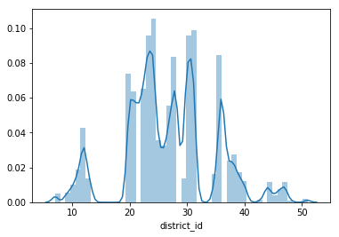
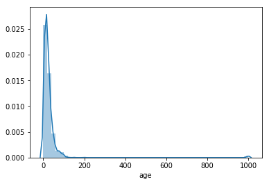
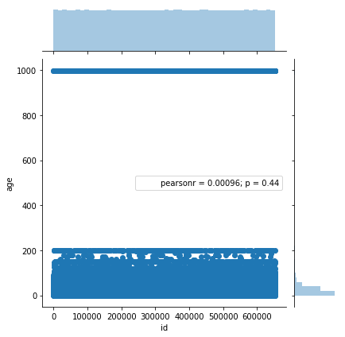
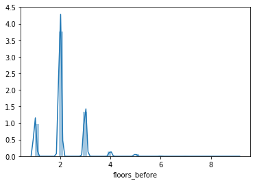
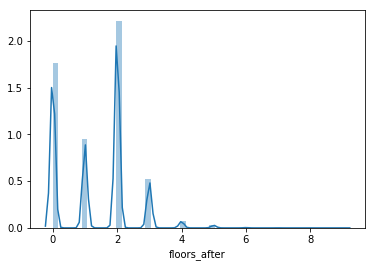
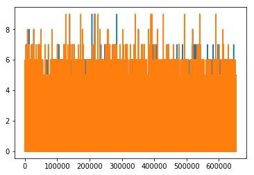
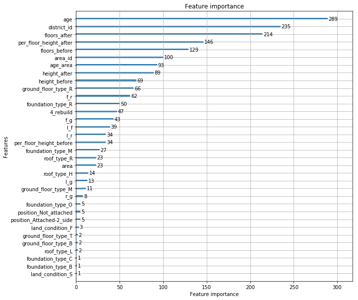

# 介绍
[地震后建筑修复建议](http://sofasofa.io/competition.php?id=8)是SofaSofa提供的练习比赛，可以说它是一个多分类问题，也可以说它是一个小型的推荐系统。因为它有四个类，评价标准是`map@2`。<br>
写这个比赛的目的是练习一下前面学的`数据探索(EDA)`和`数据预处理`，还有建模时用到的'blend'和'stacking'。具体代码都在jupyter notebook 文件里，这里简单介绍一下。

# EDA
首先从最基本的开始，
``` Python
trainData.info()
```
```
<class 'pandas.core.frame.DataFrame'>
RangeIndex: 652936 entries, 0 to 652935
Data columns (total 15 columns):
id                   652936 non-null int64
district_id          652936 non-null int64
area_id              652936 non-null int64
floors_before        652936 non-null int64
floors_after         652936 non-null int64
age                  652936 non-null int64
area                 652936 non-null int64
height_before        652936 non-null int64
height_after         652936 non-null int64
land_condition       652936 non-null object
foundation_type      652936 non-null object
roof_type            652936 non-null object
ground_floor_type    652936 non-null object
position             652936 non-null object
y                    652936 non-null int64
dtypes: int64(10), object(5)
memory usage: 74.7+ MB
```
``` Python
trainData.describe()
```

<div>
<table border="1" class="dataframe">
  <thead>
    <tr style="text-align: right;">
      <th></th>
      <th>id</th>
      <th>district_id</th>
      <th>area_id</th>
      <th>floors_before</th>
      <th>floors_after</th>
      <th>age</th>
      <th>area</th>
      <th>height_before</th>
      <th>height_after</th>
      <th>y</th>
    </tr>
  </thead>
  <tbody>
    <tr>
      <th>count</th>
      <td>652936.000000</td>
      <td>652936.000000</td>
      <td>652936.000000</td>
      <td>652936.000000</td>
      <td>652936.000000</td>
      <td>652936.000000</td>
      <td>652936.000000</td>
      <td>652936.000000</td>
      <td>652936.000000</td>
      <td>652936.000000</td>
    </tr>
    <tr>
      <th>mean</th>
      <td>326468.500000</td>
      <td>26.827076</td>
      <td>2711.729102</td>
      <td>2.131408</td>
      <td>1.335198</td>
      <td>27.823827</td>
      <td>418.087992</td>
      <td>16.307750</td>
      <td>10.377904</td>
      <td>2.283069</td>
    </tr>
    <tr>
      <th>std</th>
      <td>188486.532019</td>
      <td>7.777727</td>
      <td>778.158274</td>
      <td>0.727938</td>
      <td>1.097675</td>
      <td>73.181335</td>
      <td>231.655079</td>
      <td>5.810902</td>
      <td>8.646354</td>
      <td>0.960629</td>
    </tr>
    <tr>
      <th>min</th>
      <td>1.000000</td>
      <td>7.000000</td>
      <td>701.000000</td>
      <td>1.000000</td>
      <td>0.000000</td>
      <td>0.000000</td>
      <td>70.000000</td>
      <td>6.000000</td>
      <td>0.000000</td>
      <td>0.000000</td>
    </tr>
    <tr>
      <th>25%</th>
      <td>163234.750000</td>
      <td>22.000000</td>
      <td>2241.000000</td>
      <td>2.000000</td>
      <td>0.000000</td>
      <td>10.000000</td>
      <td>284.000000</td>
      <td>13.000000</td>
      <td>0.000000</td>
      <td>2.000000</td>
    </tr>
    <tr>
      <th>50%</th>
      <td>326468.500000</td>
      <td>27.000000</td>
      <td>2703.000000</td>
      <td>2.000000</td>
      <td>2.000000</td>
      <td>18.000000</td>
      <td>364.000000</td>
      <td>16.000000</td>
      <td>12.000000</td>
      <td>3.000000</td>
    </tr>
    <tr>
      <th>75%</th>
      <td>489702.250000</td>
      <td>31.000000</td>
      <td>3119.000000</td>
      <td>2.000000</td>
      <td>2.000000</td>
      <td>30.000000</td>
      <td>493.000000</td>
      <td>19.000000</td>
      <td>16.000000</td>
      <td>3.000000</td>
    </tr>
    <tr>
      <th>max</th>
      <td>652936.000000</td>
      <td>51.000000</td>
      <td>5142.000000</td>
      <td>9.000000</td>
      <td>9.000000</td>
      <td>999.000000</td>
      <td>5220.000000</td>
      <td>305.000000</td>
      <td>193.000000</td>
      <td>3.000000</td>
    </tr>
  </tbody>
</table>
</div>

### 相关性矩阵 
```python
corrMatrix = trainData.corr()
corrMatrix
```


<div>
<table border="1" class="dataframe">
  <thead>
    <tr style="text-align: right;">
      <th></th>
      <th>id</th>
      <th>district_id</th>
      <th>area_id</th>
      <th>floors_before</th>
      <th>floors_after</th>
      <th>age</th>
      <th>area</th>
      <th>height_before</th>
      <th>height_after</th>
      <th>y</th>
    </tr>
  </thead>
  <tbody>
    <tr>
      <th>id</th>
      <td>1.000000</td>
      <td>-0.001397</td>
      <td>-0.001410</td>
      <td>0.000964</td>
      <td>-0.000608</td>
      <td>0.000912</td>
      <td>-0.000127</td>
      <td>0.000733</td>
      <td>-0.000856</td>
      <td>0.001189</td>
    </tr>
    <tr>
      <th>district_id</th>
      <td>-0.001397</td>
      <td>1.000000</td>
      <td>0.999695</td>
      <td>-0.089556</td>
      <td>0.011780</td>
      <td>0.018209</td>
      <td>0.045535</td>
      <td>-0.061551</td>
      <td>0.017360</td>
      <td>-0.079135</td>
    </tr>
    <tr>
      <th>area_id</th>
      <td>-0.001410</td>
      <td>0.999695</td>
      <td>1.000000</td>
      <td>-0.090119</td>
      <td>0.011007</td>
      <td>0.018106</td>
      <td>0.044884</td>
      <td>-0.061716</td>
      <td>0.016755</td>
      <td>-0.078146</td>
    </tr>
    <tr>
      <th>floors_before</th>
      <td>0.000964</td>
      <td>-0.089556</td>
      <td>-0.090119</td>
      <td>1.000000</td>
      <td>0.327052</td>
      <td>0.085460</td>
      <td>0.102304</td>
      <td>0.772104</td>
      <td>0.253478</td>
      <td>0.186285</td>
    </tr>
    <tr>
      <th>floors_after</th>
      <td>-0.000608</td>
      <td>0.011780</td>
      <td>0.011007</td>
      <td>0.327052</td>
      <td>1.000000</td>
      <td>0.030074</td>
      <td>0.122605</td>
      <td>0.297664</td>
      <td>0.941350</td>
      <td>-0.406570</td>
    </tr>
    <tr>
      <th>age</th>
      <td>0.000912</td>
      <td>0.018209</td>
      <td>0.018106</td>
      <td>0.085460</td>
      <td>0.030074</td>
      <td>1.000000</td>
      <td>-0.004666</td>
      <td>0.062896</td>
      <td>0.018811</td>
      <td>0.044594</td>
    </tr>
    <tr>
      <th>area</th>
      <td>-0.000127</td>
      <td>0.045535</td>
      <td>0.044884</td>
      <td>0.102304</td>
      <td>0.122605</td>
      <td>-0.004666</td>
      <td>1.000000</td>
      <td>0.198313</td>
      <td>0.178050</td>
      <td>-0.152052</td>
    </tr>
    <tr>
      <th>height_before</th>
      <td>0.000733</td>
      <td>-0.061551</td>
      <td>-0.061716</td>
      <td>0.772104</td>
      <td>0.297664</td>
      <td>0.062896</td>
      <td>0.198313</td>
      <td>1.000000</td>
      <td>0.389301</td>
      <td>0.086521</td>
    </tr>
    <tr>
      <th>height_after</th>
      <td>-0.000856</td>
      <td>0.017360</td>
      <td>0.016755</td>
      <td>0.253478</td>
      <td>0.941350</td>
      <td>0.018811</td>
      <td>0.178050</td>
      <td>0.389301</td>
      <td>1.000000</td>
      <td>-0.442474</td>
    </tr>
    <tr>
      <th>y</th>
      <td>0.001189</td>
      <td>-0.079135</td>
      <td>-0.078146</td>
      <td>0.186285</td>
      <td>-0.406570</td>
      <td>0.044594</td>
      <td>-0.152052</td>
      <td>0.086521</td>
      <td>-0.442474</td>
      <td>1.000000</td>
    </tr>
  </tbody>
</table>
</div>


```python
corrMatrix['y']
```
    id               0.001189
    district_id     -0.079135
    area_id         -0.078146
    floors_before    0.186285
    floors_after    -0.406570
    age              0.044594
    area            -0.152052
    height_before    0.086521
    height_after    -0.442474
    y                1.000000
    Name: y, dtype: float64

## 数据离散化
数据离散化是有风险的，因为离散化后的数据效能未必会比离散化之前好，一般是根据专家的建议设置区间，而不是随意猜测一个区间。这里是利用无监督模型(K-means 算法)聚类，将id类的数据分段。<br>
首先看下数据的分布，猜测一下应该聚成几类，因为k-means算法要求提供聚类的簇数。利用seaborn可视化数据：
``` Python
sns.distplot(trainData['district_id'])
```



根据可视化后的数据分布，猜测可以聚为6类。(聚成几类是没有一个确定的答案的，可以多尝试几种情况，取最好的)
``` Python
from sklearn.cluster import KMeans
est = KMeans(n_clusters=6, init="k-means++", n_jobs=-1)
est.fit(trainData['district_id'].reshape(-1, 1))
trainData['district_id'] = est.predict(trainData['district_id'].reshape(-1, 1))
```
这里id类型的数据，我都是这样处理的。

## 处理异常值
#### `age`属性。
可视化后是这样的
``` Python
sns.distplot(trainData['age'])
```


一直延续到1000，猜测可能有问题。绘制散点图看看。
```Python
sns.jointplot(data=trainData, x='id', y='age')
```


1000那里突然就出现一堆数据 ，猜测可能是出题热故意设置的，处理方法是直接删除。
``` Python
# 删除大于阈值的行
index = trainData['age'] <= 176
trainData = trainData[index]
```

####  `floors`属性
数据集中提供了楼层前后高度信息，猜测可能会存在一些异常值，地震楼层数会比地震前还有高。首先进行可视化

地震前:`floors_before`
``` Python
sns.distplot(trainData['floors_before'])
```




地震后:`floors_after`
```Python
sns.distplot(trainData['floors_after'])
```



地震前后楼层数对比
``` Python 
plt.plot(trainData['id'], trainData['floors_before'], trainData['id'], trainData['floors_after'])
```



从图上可以发现，确实有些数据像说的那样。先计算下个数
``` Python
error_floor = trainData['floors_before'] < trainData['floors_after']
# 震后楼层数比震前还高的数量
error_floor.sum()
```
    1838

有1838个，直接删除
``` Python
# 直接去掉
index = trainData['floors_before'] >= trainData['floors_after']
trainData = trainData[index]
```

#### `height`属性
`height`也提供了前后高度，处理方法是一样的。

```Python
error_height = trainData['height_after'] > trainData['height_before']
error_height.sum()
```
    1517
``` Python
index = trainData['height_after'] <= trainData['height_before']
trainData = trainData[index]
```

## 标签数据-独热编码(one-hot)
``` Python
trainData = pd.get_dummies(trainData, columns=['position', 'land_condition', 'foundation_type', 'roof_type', 'ground_floor_type'])
```

## 构造属性
加减乘数，构造属性
``` Python
trainData['per_floor_height_before'] = trainData['height_before'] / trainData['floors_before']
trainData['per_floor_height_after'] = trainData['height_after'] / trainData['floors_after']
trainData["age_area"] = trainData['age'] / trainData['area']
```

标签数据编号
```  Python
land_condition.replace(['F', 'M', 'S'], [1, 2, 3], inplace=True)
foundation_type.replace(['M', 'C', 'R', 'B', 'O'], [5, 4, 3, 2, 1], inplace=True)
roof_type.replace(['L', 'H', 'R'], [3, 2, 1], inplace=True)
ground_floor_type.replace(['M', 'R', 'B', 'T', 'O'], [5, 4, 3, 2, 1], inplace=True)
```

用one-hot后的数据构造新属性
``` Python
trainData['4_rebuild'] = land_condition + foundation_type + roof_type + ground_floor_type
trainData['l_f'] = land_condition + foundation_type
trainData['l_r'] = land_condition + roof_type
trainData['l_g'] = land_condition + ground_floor_type
trainData['f_r'] = foundation_type + roof_type
trainData['f_g'] = foundation_type + ground_floor_type
trainData['r_g'] = roof_type + ground_floor_type
```

## lightGBM模型生成特征重要性图
``` Python
import lightgbm as lgb

params = {
    'learning_rate':0.1,
    'lambda_l1':0.1,
    'lambda_l2':0.2,
    'max_depth':4,
    'objective':'multiclass',
    'num_class':4
}

lgb_train = lgb.Dataset(train, y)
lgb_eval = lgb.Dataset(train, y)
gbm = lgb.train(params,
                lgb_train,
                num_boost_round=50,
                valid_sets=lgb_eval,
                early_stopping_rounds=5)
lgb.plot_importance(gbm, figsize=(10,10))
```


## 生成新的相关性矩阵
``` Python
corr = trainData.corr()
corr['y'].sort_values()
```
```
per_floor_height_after     -0.517127
height_after               -0.443536
floors_after               -0.405705
ground_floor_type_R        -0.382114
roof_type_R                -0.331644
foundation_type_R          -0.314671
foundation_type_B          -0.205903
area_id                    -0.175130
foundation_type_C          -0.172373
area                       -0.149299
per_floor_height_before    -0.146806
district_id                -0.085735
position_Not attached      -0.049879
foundation_type_O          -0.030112
land_condition_F           -0.023559
ground_floor_type_O        -0.022835
ground_floor_type_T        -0.016830
position_Attached-2 side   -0.012019
ground_floor_type_B         0.002914
land_condition_M            0.016435
position_Attached-3 side    0.017995
land_condition_S            0.018032
position_Attached-1 side    0.058592
roof_type_H                 0.082415
height_before               0.094980
roof_type_L                 0.097213
l_g                         0.156026
l_r                         0.174592
floors_before               0.192760
age_area                    0.202228
age                         0.222218
r_g                         0.244821
ground_floor_type_M         0.283176
l_f                         0.336764
4_rebuild                   0.365961
f_r                         0.373940
f_g                         0.375418
foundation_type_M           0.414113
y                           1.000000
Name: y, dtype: float64
```
可以看出构造出的几个属性相关性较强。

# 建模
## 构建评分函数
它的评分标准是`map@2`
> 简单来说，对于每一个建筑，若主修复意见正确，得1分；若次修复意见正确，得0.5分；若都不正确，记0分。所有建筑的得分的均值就是map@2

```Python
def test_score(y1, y2, trueLabels):
    pred_score = (y1 == trueLabels).sum() / len(trueLabels)
    pred_score += (y2 == trueLabels).sum() * 0.5 / len(trueLabels)
    return pred_score
```

## XGBOOST
``` Python
import xgboost as xgb
xgb_model = xgb.XGBClassifier(objective='multi:softmax',
                              eval_metric=['map@2', 'merror'],
                              n_estimators=700,
                              num_class=4,
                              silent=1,
                              max_depth=6,
                              nthread=4,
                              learning_rate=0.1,
                              gamma=0.5,
                              min_child_weight=0.6,
                              max_delta_step=0.1,
                              subsample=0.6,
                              colsample_bytree=0.7,
                              reg_lambda=0.4,
                              reg_alpha=0.8,
                              num_leaves=250,
                              early_stopping_rounds=20,
                              num_boost_round=8000,
                              scale_pos_weight=1)
xgb_model.fit(train, y)
pb = xgb_model.predict_proba(train)
pb = np.array(pb)
submit = pd.DataFrame()
submit['y1'] = pb.argsort()[np.arange(len(pb)), -1]
submit['y2'] = pb.argsort()[np.arange(len(pb)), -2]
print(test_score(submit['y1'].values, submit['y2'].values, y))
```
    0.774950502878

## LightGBM
``` Python
import lightgbm as lgb
lgb_train = lgb.Dataset(train[:600000], y[:600000])  
lgb_eval = lgb.Dataset(train[600000:], y[600000:], reference=lgb_train)  
sakf 
params = {  
    'boosting_type': 'gbdt',  
    'objective': 'multiclass',  
    'num_class': 4,  
    'metric': ['multi_error', 'map@2'],  # 'map@2', 
    'num_leaves': 250, # 4
    'min_data_in_leaf': 100,
    'learning_rate': 0.1,  
#     'feature_fraction': 0.3,  
    'bagging_fraction': 0.8,  
    'bagging_freq': 5,  
    'lambda_l1': 0.4,  
    'lambda_l2': 0.6,
    'max_depth':6,
#     'min_gain_to_split': 0.2,  
    'verbose': 5,  
    'is_unbalance': True
}  
  
print('Start training...')  
gbm = lgb.train(params,  
                lgb_train,  
                num_boost_round=8000,  
                valid_sets=lgb_eval,  
                early_stopping_rounds=500)  
  
```
``` Python
print('Start predicting...')
pb = gbm.predict(train, num_iteration=gbm.best_iteration)
pb = np.array(pb)
submit = pd.DataFrame()
submit['y1'] = pb.argsort()[np.arange(len(pb)), -1]
submit['y2'] = pb.argsort()[np.arange(len(pb)), -2]
print(test_score(submit['y1'].values, submit['y2'].values, y))
```
    Start predicting...
    0.796050152949

## 神经网络
``` Python
from sklearn.preprocessing import OneHotEncoder
enc = OneHotEncoder()
enc.fit(y.reshape(-1, 1))
y_hot = enc.transform(y.reshape(-1, 1))


#构建LM神经网络模型
from keras.models import Sequential #导入神经网络初始化函数
from keras.layers.core import Dense, Activation #导入神经网络层函数、激活函数
from keras.layers import Dropout
from keras.metrics import top_k_categorical_accuracy
from keras.callbacks import EarlyStopping
netfile = './net.model' #构建的神经网络模型存储路径

def acc_top2(y_true, y_pred):
    return top_k_categorical_accuracy(y_true, y_pred, k=2)

net = Sequential()
net.add(Dense(input_dim = 38, output_dim = 128))
net.add(Activation('relu'))
net.add(Dense(input_dim = 128, output_dim = 256))
net.add(Activation('relu'))
net.add(Dense(input_dim = 256, output_dim = 256))
net.add(Activation('relu'))
net.add(Dropout(0.3))
net.add(Dense(input_dim = 256, output_dim = 512))
net.add(Activation('relu'))
net.add(Dense(input_dim = 512, output_dim = 4))
net.add(Activation('softmax'))
net.compile(loss = 'categorical_crossentropy', optimizer = 'adam', metrics=['accuracy']) # accuracy
early_stopping = EarlyStopping(monitor='val_loss', patience=50, verbose=2)

net.fit(train, y_hot, epochs=150, batch_size=4096, validation_data=(train[600000:], y_hot[600000:]), callbacks=[early_stopping])
net.save_weights(netfile) #保存模型
```
``` Python
predict_prob = net.predict_proba(train[600000:])
pb = np.array(predict_prob)
submit = pd.DataFrame()
submit['y1'] = pb.argsort()[np.arange(len(pb)), -1]
submit['y2'] = pb.argsort()[np.arange(len(pb)), -2]
print(test_score(submit['y1'].values, submit['y2'].values, y[600000:]))
```
    0.775790784004

## XGBOOST生成新特征
``` Python
from sklearn.model_selection import train_test_split
X_train, X_test, y_train, y_test = train_test_split(train, y, test_size=0.2, random_state=0)##test_size测试集合所占比例
##X_train_1用于生成模型  X_train_2用于和新特征组成新训练集合
X_train_1, X_train_2, y_train_1, y_train_2 = train_test_split(X_train, y_train, test_size=0.7, random_state=0)

def mergeToOne(X,X2):
    return np.hstack((X, X2))
```

``` Python
from xgboost.sklearn import XGBClassifier
xgb = XGBClassifier(booster='gbtree', 
                    learning_rate =0.1,
                    objective='multi:softmax', 
                    num_class=4, 
                    gamma=0.05, 
                    subsample=0.4, 
                    reg_alpha=1e-05,
                    n_estimators=50,
                    metric='multi_logloss',
                    colsample_bytree=0.7, 
                    silent=1, 
                    nthread=4)

xgb.fit(X_train_1, y_train_1)
new_feature= xgb.apply(X_train_2)

X_train_new2 = mergeToOne(X_train_2,new_feature)
new_feature_test = xgb.apply(X_test)
X_test_new = mergeToOne(X_test,new_feature_test)
```

## blend
``` Python
import numpy as np
from sklearn.cross_validation import StratifiedKFold
from sklearn.ensemble import RandomForestClassifier, ExtraTreesClassifier
from sklearn.ensemble import GradientBoostingClassifier
from sklearn.linear_model import LogisticRegression
from xgboost.sklearn import XGBClassifier
import lightgbm as lgb

def blend(X, y, X_submission, n_folds):
    skf = list(StratifiedKFold(y, n_folds))

    clfs = [RandomForestClassifier(n_estimators=150, min_samples_split=90, min_samples_leaf=15,max_depth=8, n_jobs=-1, criterion='gini'),
            RandomForestClassifier(n_estimators=150, min_samples_split=90, min_samples_leaf=15,max_depth=8, n_jobs=-1, criterion='entropy'),
            ExtraTreesClassifier(n_estimators=150, min_samples_split=90, min_samples_leaf=15,max_depth=8, n_jobs=-1, criterion='gini'),
            ExtraTreesClassifier(n_estimators=150, min_samples_split=90, min_samples_leaf=15,max_depth=8, n_jobs=-1, criterion='entropy'),
            GradientBoostingClassifier(learning_rate=0.05, subsample=0.5, max_depth=6, n_estimators=8),
            XGBClassifier(learning_rate =0.05, n_estimators=300, max_depth=6, min_child_weight=1, gamma=0.1, subsample=0.8, 
                    colsample_bytree=0.8, objective= 'multi:softmax', nthread=4, eg_alpha=0.001, scale_pos_weight=1),
            lgb.LGBMClassifier(learning_rate=0.1, boosting_type='gbdt', objective='multiclass', n_estimators=300, metric='multi_logloss', 
                             max_depth=7, num_leaves=5, subsample=0.7, colsample_bytree=0.7, min_data_in_leaf=45, feature_fraction=0.7, bagging_fraction=0.7,
                             bagging_freq=6, lambda_l1=1, lambda_l2=0.001, min_gain_to_split=0.265, verbose=5, is_unbalance=True)]
    
    
    
    
    dataset_blend_train = np.zeros((X.shape[0], len(clfs)))

    dataset_blend_test = np.zeros((X_submission.shape[0], len(clfs)))

    for j, clf in enumerate(clfs):
        print (j, clf)
        dataset_blend_test_j = np.zeros((X_submission.shape[0], len(skf)))
        for i, (train, test) in enumerate(skf):
            print ("Fold", i)
            X_train = X[train]
            y_train = y[train]
            X_test = X[test]
            y_test = y[test]
            clf.fit(X_train, y_train)
            y_submission = clf.predict_proba(X_test)[:, 1]
            dataset_blend_train[test, j] = y_submission
            dataset_blend_test_j[:, i] = clf.predict_proba(X_submission)[:, 1]
        dataset_blend_test[:, j] = dataset_blend_test_j.mean(1)
    print("Blending.")
    clf = LogisticRegression()
    clf.fit(dataset_blend_train, y)
    y_submission = clf.predict_proba(dataset_blend_test)[:, 1]

    return clf.predict_proba(dataset_blend_test)
```

## Stacking
> emmmm，这个我不确定是不是这样写。
``` Python
import lightgbm as lgb
from xgboost.sklearn import XGBClassifier
from sklearn.ensemble import RandomForestClassifier
xgb = XGBClassifier(booster='gbtree', 
                    learning_rate =0.1,
                    objective='multi:softmax', 
                    num_class=4, 
                    gamma=0.05, 
                    subsample=0.4, 
                    reg_alpha=1e-05,
                    n_estimators=50,
                    metric='multi_logloss',
                    colsample_bytree=0.7, 
                    silent=1, 
                    nthread=4)

gbm = lgb.LGBMClassifier(learning_rate=0.1, 
                   boosting_type='gbdt', 
                   objective='multiclass',
                   n_estimators=50,
                   metric='multi_logloss', 
                   max_depth=7, 
                   bagging_fraction=0.7, 
                   is_unbalance=True)

rf = RandomForestClassifier(n_estimators=50, 
                            min_samples_split=90, 
                            min_samples_leaf=15,
                            max_depth=8,
                            oob_score=True)
```

```  Python
xgb.fit(X_train_1, y_train_1)
new_feature= xgb.apply(X_train_2)

X_train_new2 = mergeToOne(X_train_2,new_feature)
new_feature_test = xgb.apply(X_test)
X_test_new = mergeToOne(X_test,new_feature_test)


gbm.fit(X_train_1, y_train_1)
new_feature = gbm.apply(X_train_2)

X_train_new2 = mergeToOne(X_train_new2,new_feature)
new_feature_test = gbm.apply(X_test)
X_test_new = mergeToOne(X_test_new,new_feature_test)


rf.fit(X_train_1, y_train_1)
new_feature = rf.apply(X_train_2)
X_train_new2 = mergeToOne(X_train_new2, new_feature)
new_feature_test = rf.apply(X_test)
X_test_new = mergeToOne(X_test_new, new_feature_test)

```
## 加权投票
``` Python
def wsubmit(xg, lg, nn):
    xg_y1 = xg['y1'].values
    lg_y1 = lg['y1'].values
    lg_y2 = lg['y2'].values
    nn_y1 = lg['y1'].values
    submitData = pd.DataFrame()
    y1 = []
    y2 = []
    for i in range(len(xg)):
        row_y1 = [xg_y1[i], lg_y1[i], nn_y1[i]]
        y1.append(max(row_y1, key=row_y1.count))
        if max(row_y1, key=row_y1.count) != lg_y1[i]:
            y2.append(lg_y1[i])
        else:
            y2.append(lg_y2[i])
    submitData['y1'] = y1
    submitData['y2'] = y2
    submitData.to_csv('submit_voting.csv', index=False)
```

# 总结
这次主要是锻炼之前学到的东西，实际比赛排名不是很高。